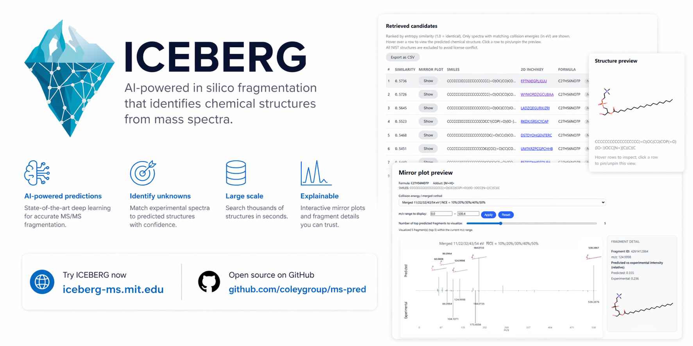

#  Mass Spectrum Predictors

**Update 7/7/2026:** 
- Introducing ICEBERG 2.1! It has a substantial GPU speedup, and we provide pretrained NIST'23 model. Checkout to the [ICEBERG 2.0 branch](https://github.com/coleygroup/ms-pred/tree/iceberg_2.0) if you want to run the earlier 2.0 model.
- Introducing GLACIER! GLACIER is our state-of-the-art single-stage MS/MS simulator that is even faster and more accurate. Check [our preprint](https://arxiv.org/abs/2606.29161).

[](http://iceberg-ms.mit.edu/)

**Update 4/4/2026:** You can run ICEBERG structural elucidation easily at http://iceberg-ms.mit.edu/! By inputting the chemical formula and your experimental spectrum, the WebUI will rank it against all candidates from PubChem. No GPU is required.

------------

This repository contains implementations for the following spectrum simulator models predicting molecular tandem mass spectra from molecules: 
- 🏔️ GLACIER 🏔️: GLACIER: Rethinking Mass Spectrum Prediction as an Object Detection Problem
- 🧊 ICEBERG 2.1 🧊️: [Neural Spectral Prediction for Structure Elucidation with Tandem Mass Spectrometry](https://www.biorxiv.org/content/10.1101/2025.05.28.656653v1)
- 🏃‍ MARASON 🏃‍: [Neural Graph Matching Improves Retrieval Augmented Generation in Molecular Machine Learning](https://arxiv.org/html/2502.17874)
- 🧣 SCARF 🧣: [Subformula Classification for Autoregressively Reconstructing Fragmentations](https://arxiv.org/abs/2303.06470)

GLACIER, ICEBERG, and MARASON predict spectra at the level of molecular fragments, whereas SCARF predicts spectra at the level of chemical formula. In order to fairly compare various spectra models, we implement a number of baselines and alternative models using equivalent settings across models (i.e., same covariates, hyperparameter sweeps for each, etc.):
 
1. *NEIMS* using both FFN and GNN encoders from [Rapid prediction of electron–ionization mass spectrometry using neural networks](https://pubs.acs.org/doi/full/10.1021/acscentsci.9b00085)    
2. *MassFormer* from [MassFormer: Tandem Mass Spectrum Prediction for Small Molecules using Graph Transformers](https://arxiv.org/abs/2111.04824)  
3. *3DMolMS* from [3DMolMS: Prediction of Tandem Mass Spectra from Three Dimensional Molecular Conformations](https://www.biorxiv.org/content/10.1101/2023.03.15.532823v1)  
4. *GrAFF-MS* from [Efficiently predicting high resolution mass spectra with graph neural networks](https://arxiv.org/pdf/2301.11419.pdf)
5. *CFM-ID* from [CFM-ID 4.0: More Accurate ESI-MS/MS Spectral Prediction and Compound Identification](https://pubs.acs.org/doi/10.1021/acs.analchem.1c01465) (not retrained; instructions for running are provided)


Contributors: Sam Goldman, Runzhong Wang, Rui-Xi Wang, Mrunali Manjrekar, John Bradshaw, Janet Li, Jiayi Xin, Connor W. Coley


## Contents


1. [Install](#setup)  
2. [Demo](#demo)
3. [Data](#data)
4. [Experiments](#experiments)    
5. [Analysis](#analysis)    
6. [Structural elucidation](#elucidation)    
7. [Citation](#citation)    


## Install & setup <a name="setup"></a>

Install [uv](https://docs.astral.sh/uv/) if it is not on your system. On Linux or macOS, run:
```shell
curl -LsSf https://astral.sh/uv/install.sh | sh
```
Please refer to the [official uv installation guide](https://docs.astral.sh/uv/getting-started/installation/) for other platforms and installation methods.

Make sure you have ``gcc`` installed. Create the environment from ``pyproject.toml`` with one accelerator extra. For CUDA 12.4, run:
```shell
uv sync --extra cu124
source .venv/bin/activate
```
Installation will take ~10 minutes.

For CUDA 11.8, use:
```shell
uv sync --extra cu118
source .venv/bin/activate
```

For CPU-only installs, use:
```shell
uv sync --extra cpu
source .venv/bin/activate
```

The ``cpu``, ``cu118``, and ``cu124`` extras are mutually exclusive; choose exactly one. Optional dependency groups can be added to the same command, for example:
```shell
uv sync --extra cu124 --extra test --extra mces
```

For WebUI dependencies, add the ``webui`` extra:
```shell
uv sync --extra cpu --extra webui
```

## Demo <a name="demo"></a>
To easily get started, you can run ICEBERG structural elucidation at the WebUI: http://iceberg-ms.mit.edu/.
It supports retrieval from 91 million structures in PubChem, excluding those structures in NIST'23 to avoid license conflict.

If you want more flexibility by doing some coding, a demo of how to use mass spectrum predictors (ICEBERG as an example) for structural elucidation campaigns can be found at [``notebooks/iceberg_2025_biorxiv/iceberg_demo_pubchem_elucidation.ipynb``](notebooks/iceberg_2025_biorxiv/iceberg_demo_pubchem_elucidation.ipynb).

Please go through the following prerequisites to run the demo:
* Clone the repository ``git clone https://github.com/coleygroup/ms-pred.git``.
* Start a jupyter notebook server (by ``jupyter notebook``), and navigate to ``notebooks/iceberg_2025_biorxiv/iceberg_demo_pubchem_elucidation.ipynb`` in the web UI.
* Get pretrained ICEBERG model weights.
    * You can either train the model by yourself (following instructions below);
    * Or if you have an NSIT'20/23/26 license, you can [email the maintainer with a proof of license](mailto:runzhong@mit.edu?subject=Inquiry%20of%20pretrianed%20ICEBERG%20on%20NIST20&body=My%20organization%20has%20a%20NIST'20%20(or%20newer)%20license%20and%20I%20would%20like%20to%20receive%20pretrained%20weights%20of%20ICEBERG%20on%20NIST'20.%20Please%20find%20the%20proof%20of%20purchase%20as%20attached.) and we will send you the weights;
    * Or you can use the [open-source MassSpecGym-trained weights](https://www.dropbox.com/scl/fo/kwm35ih8tlfnshfrcq8ot/AOeS4M0_v9MhqeEZys9sCRQ?rlkey=f1n6pbzx94g1k2el2wcbmee61&st=dcl9pbyp&dl=0). 
* Update [``the configuration file``](configs/iceberg/iceberg_elucidation.yaml) based your local setting. Change ``python_path`` to your Python excutiable, and update ``gen_ckpt`` and ``inten_ckpt`` to the path of your pretrained models.
    * When you have a GPU with smaller RAM, set smaller numbers for ``batch_size`` and ``num_workers`` to fit the model into GPU RAM (``batch_size: 8``, ``num_workers: 6`` tested on NVIDIA RTX 4070M 8GB; ``batch_size: 8``, ``num_workers: 12`` tested on NVIDIA RTX A5000 24GB).
    * CPU-only inference is also feasible if you set ``cuda_devices: None``.
 
Running the demo takes <2 minutes with a regular desktop GPU.

## Data <a name="data"></a>

> We are retiring the support of the NPLIB1 dataset (also referred as CANOPUS sometimes) in the main branch. 
> You can checkout to the [``iceberg_1.0`` branch](https://github.com/coleygroup/ms-pred/tree/iceberg_1.0)
> with the legacy code that supports NPLIB1.

``nist20/nist23`` is a commercial dataset available for purchase through [several vendors worldwide](https://chemdata.nist.gov/dokuwiki/doku.php?id=chemdata:distributors).
Given the scale of effort required to purchase samples, run experiments, and collect such a large amount of spectra,
and that NIST is the only database where all spectra have collision energy annotations, this dataset is a reasonable investment in mass spectrum-related research in the
absence of a thorough open-source replacement. 

After your purchase of NIST, export the raw data as ``.SDF``. A detailed instruction on NIST'20 could be found [here](https://github.com/Roestlab/massformer?tab=readme-ov-file#exporting-the-nist-data) 
(select ``.SDF`` in output format). The code to process raw data could be found at ``reformat_nist_lcmsms_sdf.py`` in [this repo](https://github.com/rogerwwww/ms-data-parser).
Once the dataset is processed, move the files to ``ms-pred/data/spec_datasets/nist20`` and make sure it looks like
```
└── nist20
    ├── labels.tsv
    ├── mgf_files
    ├── spec_files.hdf5
    └── splits
```
Rename ``nist20`` with ``nist23`` if you are working with the newer version.


### MassSpecGym Data Processing

We support two MassSpecGym processing settings for ICEBERG:

1. `msg_simulation`: the official MassSpecGym simulation-challenge subset.
2. `msg_all`: a streamlined ICEBERG workflow for using all MassSpecGym entries
   in the main retrieval benchmark.

#### `msg_simulation`: Official Simulation-Challenge Subset

The `msg_simulation` dataset is the MassSpecGym simulation-challenge subset. It is generated from the public
MassSpecGym 1.5 data on Hugging Face and keeps only rows with
`simulation_challenge == True` and known collision energies.

First, make sure the base MassSpecGym dataset resources are available under
`data/spec_datasets/msg`. At minimum, this directory should contain the spectrum
HDF5 and the retrieval candidate tables you want to reuse:

```text
data/spec_datasets/msg/
├── labels.tsv
├── spec_files.hdf5
└── retrieval/
    ├── cands_df_test_formula_256.tsv
    └── cands_df_test_mass_256.tsv
```

Then run:

```shell
python data_scripts/create_msg_simulation_dataset.py \
  --source-table https://huggingface.co/datasets/roman-bushuiev/MassSpecGym/resolve/main/data/MassSpecGym1.5.tsv \
  --source-dataset data/spec_datasets/msg \
  --output-dataset data/spec_datasets/msg_simulation \
  --force-output \
  --overwrite \
  --audit-out data/spec_datasets/msg_simulation/audit.json
```

The command writes `data/spec_datasets/msg_simulation/labels.tsv`,
`data/spec_datasets/msg_simulation/splits/split.tsv`, filtered retrieval
candidate tables, and small debug files for quick smoke checks. It also links or
copies reusable resources from `data/spec_datasets/msg`, including
`spec_files.hdf5`, `magma_outputs`, and `subformulae` when they are present.

After generation, check the audit:

```shell
python - <<'PY'
import json
from pathlib import Path

audit = json.loads(Path("data/spec_datasets/msg_simulation/audit.json").read_text())
print(audit["output_rows"], audit["output_unique_specs"])
print(audit["imputed_check"])
PY
```

For the current MassSpecGym 1.5 TSV, the expected output is 119,029 unique
simulation-challenge spectra and zero imputed labels.

#### `msg_all`: Full MassSpecGym ICEBERG Workflow

The `msg_all` setting provides an ICEBERG processing framework for all
MassSpecGym entries. The configuration files live under
`configs/iceberg/msg_all`, with the staged pipeline scripts under
`run_scripts/iceberg/msg_all`.

This setting is needed because ICEBERG 2.0+ models use collision energy as an
input, while not every MassSpecGym entry has an annotated collision energy. The
workflow first trains ICEBERG on the subset with known collision energies, uses
that model to annotate missing collision energies and generate pseudo labels,
then trains again on the full dataset containing both real and imputed collision
energy labels. The resulting full-dataset model is then evaluated on the full
MassSpecGym retrieval benchmark, which enables a fair comparison of ICEBERG on
the main MassSpecGym task.

The end-to-end stage order is encoded in
`run_scripts/iceberg/msg_all/run_all.sh`:

```text
train on known collision energies
-> predict known-CE spectra
-> train the known-CE intensity model
-> impute missing collision energies with ICEBERG
-> build data/spec_datasets/msg_all_iceberg
-> assign subformulae
-> train on the full real+pseudo-labeled dataset
-> evaluate retrieval on the full benchmark
```

### SCARF Processing

Data should then be assigned to subformulae files using
`data_scripts/forms/assign_subformulae.py`, which will preprocess the data. We
produce two fragment versions of the molecule, `magma_subform_50` and
`no_subform`. The former strictly labels subformula based upon smiles structure
and the latter is permissive and allows all entries to pass.

```
. data_scripts/all_assign_subform.sh
```


### ICEBERG and GLACIER Processing

In addition to building processed subformulae, to train ICEBERG and GLACIER, we must
annotate substructures and create a labeled dataset over the breakage process, 
which we do with the MAGMa algorithm.

This can be done with the following script, specifying an appropriate dataset:

```

. data_scripts/dag/run_magma.sh

```

To get the PubChem-SMILES mapping that's required for contrastive finetuning, 
please download [pubchem_formulae_inchikey.hdf5](https://zenodo.org/records/15529765/files/pubchem_formulae_inchikey.hdf5)
and place it at ``data/pubchem/pubchem_formulae_inchikey.hdf5`` 
You don't need this if you decide to skip contrastive finetuning.


### Retrieval

To conduct retrieval experiments, libraries of smiles must be created. A PubChem
library is converted and each chemical formula is mapped to (smiles, inchikey)
pairs. Subsets are selected for evaluation.  Making formula subsets takes longer
(on the order of several hours, even parallelized) as it requires converting
each molecule in PubChem to a mol / InChI. 

```

source data_scripts/pubchem/01_download_smiles.sh
python data_scripts/pubchem/02_make_formula_subsets.py
python data_scripts/pubchem/03_dataset_subset.py --dataset-labels data/spec_datasets/nist20/labels.tsv # for nist20 dataset
python data_scripts/pubchem/04_make_retrieval_lists.py

# optional, if you want per chemical class analysis
python data_scripts/predict_chemical_class.py
```

 
## Experiments <a name="experiments"></a>

### ICEBERG 2.1

ICEBERG 2.1 is our recommended model with a ~3 times speedup and official support on NIST'23. 
ICEBERG is trained in two parts: a learned fragment generator and an intensity predictor. The pipeline for training and evaluating this model can be accessed in `run_scripts/iceberg/`. 
There is an all-in-one script ``run_scripts/iceberg/nist23/run_all.sh`` that trains ICEBERG 2.1 on NIST'23 dataset.

#### Pretrained ICEBERG 2.1 Model Weights on MassSpecGym

We provide pretrained ICEBERG 2.1 model weights for the MassSpecGym workflows:

1. [`msg_all`](https://www.dropbox.com/scl/fo/kwm35ih8tlfnshfrcq8ot/AOeS4M0_v9MhqeEZys9sCRQ?rlkey=f1n6pbzx94g1k2el2wcbmee61&st=dcl9pbyp&dl=0)
2. [`msg_simulation`](https://www.dropbox.com/scl/fo/mcj0ngdvuj2xkhr983frb/ABGLrS8ZCeyYUWhzRfxPtRg?rlkey=rccvo52cehh75ma1yy8jji46t&st=4e3b946v&dl=0)


Current version is an update to ICEBERG 2.0 which is described in [Wang et al. (2025)](https://doi.org/10.1101/2025.05.28.656653), available at the [``iceberg_2.0`` branch](https://github.com/coleygroup/ms-pred/tree/iceberg_2.0). 
The archived version released with [Goldman et al. (2024)](http://arxiv.org/abs/2304.13136) is at the [``iceberg_1.0`` branch](https://github.com/coleygroup/ms-pred/tree/iceberg_1.0).
The internal pipeline used to conduct experiments can be followed below:

1. *Train dag model*: `run_scripts/iceberg/nist23/01_run_dag_gen_train.sh`   
2. *Sweep over the number of fragments to generate*: `run_scripts/iceberg/nist23/02_sweep_gen_thresh.py`     
3. *Use model 1 to predict model 2 training set*: `run_scripts/iceberg/nist23/03_run_dag_gen_predict.sh`   
4. *Train intensity model, including contrastive training*: `run_scripts/iceberg/nist23/04_train_dag_inten.sh`   
5. *Make and evaluate intensity predictions*: `run_scripts/iceberg/nist23/05_predict_dag_inten.py`  
6. *Run retrieval*: `run_scripts/iceberg/nist23/06_run_retrieval.py`

> The above scripts will only run for split_1_rnd1 (random split, seed=1), which is suitable if you want to train your own ICEBERG for structural elucidation applications.
> 
> If you want to replicate our reported result with random + scaffold splits and 3 random seeds, please uncomment
> all entries in the following files
> * ``configs/iceberg/nist23/*.yaml``
> * ``run_scripts/iceberg/nist23/02_sweep_gen_thresh.py``
> * ``run_scripts/iceberg/nist23/05_predict_dag_inten.py``
> * ``run_scripts/iceberg/nist23/06_run_retrieval.py``

> You need two GPUs with at least 24GB RAM to train ICEBERG (we used NVIDIA A5000 for development). If you are trying to
> train the model on a smaller GPU, try cutting down the batch size and skipping the contrastive 
> finetuning step. Note that changing training parameters will affect the model's performance.

Instead of running in batched pipeline model, individual gen training, inten
training, and predict calls can be  made using the following scripts respectively:

1. `python src/ms_pred/iceberg/train_gen.py`
2. `python src/ms_pred/iceberg/train_inten.py`
3. `python src/ms_pred/iceberg/predict_smis.py`

An example of how to use ICEBERG for structural elucidation campaigns can be found at ``notebooks/iceberg_2025_biorxiv/iceberg_demo_pubchem_elucidation.ipynb``.

Replicating the retrieval metrics and CIs for the MassSpecGym spectrum challenge hit rate evaluation can be carried out by:
1. downloading the full and deduplicated candidate sets from [Dropbox](https://www.dropbox.com/scl/fo/d73o0o4u5ymr9ubtp3m7j/AL4r7e3p9ElV0ewBwDCScbM?rlkey=tr99zkzy208ol8aw0pfsdsf5v&st=2zg9n01y&dl=0) and placing them in `data/spec_datasets/msg`,
2. changing the retrieval script in `run_scripts/iceberg/06_run_retrieval.py` to use `src/ms_pred/retrieval/retrieval_benchmark_torchmetrics.py` and uncommenting the retrieval challenge config,
3. and upon completion of ranking, running `src/ms_pred/retrieval/bootstrap_metrics.py`.

### MARASON

MARASON is trained in two parts: a learned fragment generator (the same as the one in ICEBERG) and an RAG-based intensity predictor. The pipeline for training and evaluating this model can be accessed in `run_scripts/marason/`. 
There is an all-in-one script ``run_scripts/marason/run_all.sh`` that trains the up-to-date version of MARASON on NIST'20 and MassSpecGym dataset. 
The internal pipeline used to conduct experiments can be followed below:

1. *Train dag model*: `run_scripts/marason/01_run_marason_gen_train.sh`   
2. *Sweep over the number of fragments to generate*: `run_scripts/marason/02_sweep_gen_thresh.py`     
3. *Use model 1 to predict model 2 training set*: `run_scripts/marason/03_run_marason_gen_predict.sh`   
4. *Train intensity model*: `run_scripts/marason/04_train_marason_inten.sh`   
5. *Make and evaluate intensity predictions*: `run_scripts/marason/05_predict_marason_inten.py`  
6. *Run retrieval*: `run_scripts/marason/06_run_retrieval.sh`

> The above scripts will only run for split_1_rnd1 (random split, seed=1), which is suitable if you want to train your own MARASON for structural elucidation applications.
> 
> If you want to replicate our reported result with random + scaffold splits and 3 random seeds, please uncomment
> all entries in the following files
> * ``configs/marason/*.yaml``
> * ``run_scripts/marason/02_sweep_gen_thresh.py``
> * ``run_scripts/marason/05_predict_dag_inten.py``
> * ``run_scripts/marason/06_run_retrieval.py``

> Note that since the reference-target pairs can be pre-computed, you can save the computed pairs to a given directory by setting `save-reference` 
> to true and `reference-dir` to the desired directory in `configs/marason/marason_inten_train_nist.yaml` and 
> `configs/marason/marason_inten_train_msg_allev_entropy.yaml`. 
> Once the files are stored, you can load the precomputed pairs by setting `load-reference` to true in the corresponding config files 
> and skip the retrieval process.

> You need two GPUs with at least 24GB RAM to train MARASON (we used NVIDIA A5000 for development). If you are trying to
> train the model on a smaller GPU, try cutting down the hidden_size to 256. 
> Note that changing training parameters will affect the model performance.

Instead of running in batched pipeline model, individual gen training, inten
training, and predict calls can be made using the following scripts respectively:

1. `python src/ms_pred/marason/train_gen.py`
2. `python src/ms_pred/marason/train_inten.py`
3. `python src/ms_pred/marason/predict_smis.py`

You can use `python launcher_scripts/run_from_config.py configs/marason/marason_inten_test_nist.yaml` to generate relevant analysis and visualizations in the MARASON paper. You can draw the matching pattern and the spectra visualization by setting `draw` and `plot-spec` to be true respectively. If you want to do the similarity-grouped analysis described in the paper, set `draw` and `plot-spec` to be false. The bootstrap analysis for MassSpecGym retrieval task can be carried out by running `analysis/msg_bootstrap.py`.

### GLACIER
GLACIER is the first ms/ms machine learning model that predicts multi-breakpoint fragmentation process in single pass. You can reproduce the experiments in our paper with the following scripts.
0. *Add spectral intensity to the magma heuristics prediction*: `run_scripts/glacier/add_inten.sh`
2. *Train model*: `run_scripts/glacier/01_train_joint.sh`   
3. *Predict spectral intensity*: `run_scripts/glacier/02_predict_inten.py`     
4. *Retrieval*: `run_scripts/glacier/03_run_retrieval.py` 

We provide a [checkpoint](https://www.dropbox.com/scl/fo/ta99j0mp1w7qzek5zvy3w/AFCLQNO8W2EP7ZDMOj9nxWI?rlkey=563zxtyvvhwfu1uyz6n10n2ui&st=k8km33p3&dl=0) of GLACIER trained on the MassSpecGym dataset. 

> You need two GPUs with at least 24GB RAM to train GLACIER (we used NVIDIA A5000 for development). 

### SCARF

SCARF models trained in two parts: a prefix tree generator and an intensity predictor. The pipeline for training and evaluating this model can be accessed in `run_scripts/scarf_model/`. The internal pipeline used to conduct experiments can be followed below:

1. *Train scarf model*: `run_scripts/scarf_model/01_run_scarf_gen_train.sh`
2. *Sweep number of prefixes to generate*: `run_scripts/scarf_model/02_sweep_scarf_gen_thresh.py`  
3. *Use model 1 to predict model 2 training set*: `run_scripts/scarf_model/03_scarf_gen_predict.sh`   
4. *Train intensity model*: `run_scripts/scarf_model/04_train_scarf_inten.sh`
5. *Make and evaluate intensity predictions*: `run_scripts/scarf_model/05_predict_form_inten.py`
6. *Run retrieval*: `run_scripts/scarf_model/06_run_retrieval.py`  
7. *Time scarf*: `run_scripts/scarf_model/07_time_scarf.py`  
8. *Export scarf forms* `run_scripts/scarf_model/08_export_forms.py`


Instead of running in batched pipeline model, individual gen training, inten
training, and predict calls can be  made using the following scripts respectively:

1. `python src/ms_pred/scarf_pred/train_gen.py`
2. `python src/ms_pred/scarf_pred/train_inten.py`
3. `python src/ms_pred/scarf_pred/predict_smis.py`

An additional notebook showcasing how to individually load models and make predictions can be found at `notebooks/scarf_2023_neurips/scarf_demo.ipynb`. 

We provide scripts showing how we conducted hyperparameter optimization as
well:

1. *Hyperopt scarf model*: `run_scripts/scarf_model/hyperopt_01_scarf.sh`  
2. *Hyperopt scarf inten model*: `run_scripts/scarf_model/02_sweep_scarf_gen_thresh.py`  


### FFN Spec 

Experiment pipeline utilized:  
1. *Train models*: `run_scripts/ffn_model/01_run_ffn_train.sh`
2. *Predict and eval*: `run_scripts/ffn_model/02_predict_ffn.py`
3. *Retrieval experiments*: `run_scripts/ffn_model/03_run_retrieval.py`
4. *Time ffn*: `run_scripts/ffn_model/04_time_ffn.py`

Hyperopt FFN: `run_scripts/ffn_model/hyperopt_01_ffn.sh`  


### Autoregressive baseline

Baseline used to show the effect of successively generating formula, rather
than decoding with SCARF. 

Experiment pipeline utilized:   
1. *Train models*: `run_scripts/autoregr_baseline/01_run_autoregr_train.sh`  
2. *Sweep model*: `run_scripts/autoregr_baseline/02_sweep_autoregr_thresh.py`  


Hyperparameter optimization: `run_scripts/autoregr_baseline/hyperopt_01_autoregr.sh`   

### GNN Spec 

Experiment pipeline:   

1. *Train models*: `run_scripts/gnn_model/01_run_gnn_train.sh`
2. *Predict and eval*: `run_scripts/gnn_model/02_predict_gnn.py`
3. *Retrieval experiments*: `run_scripts/gnn_model/03_run_retrieval.py`
4. *Time gnn*: `run_scripts/gnn_model/04_time_gnn.py`

Hyperopt GNN:  `run_scripts/gnn_model/hyperopt_01_gnn.sh`


### Massformer

Experiment pipeline:     
1. *Train models*: `run_scripts/massformer_model/01_run_massformer_train.sh`  
2. *Predict and eval*: `run_scripts/massformer_model/02_predict_massformer.py`  
3. *Retrieval experiments*: `run_scripts/massformer_model/03_run_retrieval.py`  
4. *Time massformer*: `run_scripts/massformer_model/04_time_massformer.py`   

Hyperopt Massformer: `run_scripts/massformer_model/hyperopt_01_massformer.sh`  


### 3DMolMS

We include a baseline implementation of 3DMolMS in which we utilize the same architecture as these authors. We note we do not include collision energy or machines as covariates for consistency with our other implemented models and data processing pipelines, which may affect performance. 

Experiment pipeline:   
1. *Train models*: `run_scripts/molnetms/01_run_ffn_train.sh`
2. *Predict and eval*: `run_scripts/molnetms/02_predict_ffn.py`
3. *Retrieval experiments*: `run_scripts/molnetms/03_run_retrieval.py`
4. *Time 3d mol ms*: `run_scripts/molnetms/04_time_molnetms.py`

Hyperopt 3DMolMS:  `run_scripts/molnetms/hyperopt_01_molnetms.sh`


### GrAFF-MS 

We include a baseline variation of GrAFF-MS in which we utilize a fixed formula vocabulary. We note we do not include collision energy or machines as covariates for consistency with our other implemented models and data processing pipelines, which may affect performance. In addition, because our data does not contain isotopic or varied adduct formula labels, we replace the marginal peak loss with a cosine similarity loss. Pleases see the [original paper](https://arxiv.org/abs/2301.11419) to better understand the release details.

Experiment pipeline:   
1. *Train models*: `run_scripts/graff_ms/01_run_ffn_train.sh`
2. *Predict and eval*: `run_scripts/graff_ms/02_predict_ffn.py`
3. *Retrieval experiments*: `run_scripts/graff_ms/03_run_retrieval.py`
4. *Time graff MS*: `run_scripts/graff_ms/04_time_graff_ms.py`

Hyperopt GrAFF-MS:  `run_scripts/graff_ms/hyperopt_01_graff_ms.sh`


### CFM-ID

CFM-ID is a well-established fragmentation-based mass spectra prediction model. We include brief instructions for utilizing this tool below

Build docker: 

```

docker pull wishartlab/cfmid:latest

```

Make prediction:

```

. run_scripts/cfm_id/run_cfm_id.py
. run_scripts/cfm_id/process_cfm.py
. run_scripts/cfm_id/process_cfm_pred.py

```

### MetFrag

MetFrag is a learning-free fragmentation method that is used for ranking candidate molecules w.r.t. mass spectra. To run MetFrag in our retrieval benchmark setting:

Download [MetFrag command line tool](https://github.com/ipb-halle/MetFragRelaunched/releases). It should look like

```
MetFragCommandLine-X.X.X.jar  # We used 2.5.6 for benchmarking
```

Make prediction:
```

. run_scripts/metfrag/run_metfrag.py
. run_scripts/metfrag/process_metfrag.py

```

### Freq baselines

As an addiitonal baseline to compare to the generative portion of our scarf
(thread), we include frequency baselines for generating form subsets:

```

. run_scripts/freq_baseline/predict_freq.py
. run_scripts/freq_baseline/predict_rand.py

```


## Analysis <a name="analysis"></a>

Analysis scripts can be found in `analysis` for evaluating both formula
predictios `analysis/form_pred_eval.py` and spectra predictions
`analysis/spec_pred_eval.py`.

Additional analyses used for figure generation were conducted in `notebooks/`.

## Structural elucidation <a name="elucidation"></a>

Forward models could be applied for structural elucidation tasks with a set of candidate structures. An example workflow by taking all PubChem structures with the same chemical formula is shown in [``notebooks/iceberg_2025_biorxiv/iceberg_demo_pubchem_elucidation.ipynb``](notebooks/iceberg_2025_biorxiv/iceberg_demo_pubchem_elucidation.ipynb). In this example, ICEBERG predicts simulated spectra for all candidates, then all candidates are ranked based on their entropy similarities to the experimental spectrum.

## Citation <a name="citation"></a>

We ask any user of this repository to cite the following works based upon the portion of the repository used.

🧣SCARF:
```
@article{goldman2023prefix,
  title={Prefix-tree decoding for predicting mass spectra from molecules},
  author={Goldman, Samuel and Bradshaw, John and Xin, Jiayi and Coley, Connor},
  journal={Advances in neural information processing systems},
  volume={36},
  pages={48548--48572},
  year={2023}
}
```

🧊ICEBERG 1.0:
```
@article{goldman2024generating,
  title={Generating molecular fragmentation graphs with autoregressive neural networks},
  author={Goldman, Samuel and Li, Janet and Coley, Connor W},
  journal={Analytical Chemistry},
  volume={96},
  number={8},
  pages={3419--3428},
  year={2024},
  publisher={ACS Publications}
}
```

🧊ICEBERG 2.0:
```
@article{wang2025neuralspec,
	author={Wang, Runzhong and Manjrekar, Mrunali and Mahjour, Babak and Avila-Pacheco, Julian and Provenzano, Joules and Reynolds, Erin and Lederbauer, Magdalena and Mashin, Eivgeni and Goldman, Samuel L. and Wang, Mingxun and Weng, Jing-Ke and Plata, Desir{\'e}e L. and Clish, Clary B. and Coley, Connor W.},
	title={Neural Spectral Prediction for Structure Elucidation with Tandem Mass Spectrometry},
	elocation-id = {2025.05.28.656653},
	year={2025},
	URL={https://www.biorxiv.org/content/early/2025/06/01/2025.05.28.656653},
	eprint={https://www.biorxiv.org/content/early/2025/06/01/2025.05.28.656653.full.pdf},
	journal={bioRxiv}
}
```

🏔️GLACIER: 
```
@article{wang2026glacier,
  title={GLACIER: Rethinking Mass Spectrum Prediction as an Object Detection Problem},
  author={Wang, Rui-Xi and Wang, Runzhong and Coley, Connor W},
  journal={arXiv preprint arXiv:2606.29161},
  year={2026}
}
```

🏃‍MARASON:
```
@article{wang2025neuralgraph,
  title={Neural Graph Matching Improves Retrieval Augmented Generation in Molecular Machine Learning},
  author={Wang, Runzhong and Wang, Rui-Xi and Manjrekar, Mrunali and Coley, Connor W},
  journal={International Conference on Machine Learning},
  year={2025}
}
```

In addition, we utilize both the NEIMS approach for our binned FFN and GNN encoders, 3DMolMS, GRAFF-MS, Massformer, MAGMa for constructing formula labels, and CFM-ID as a baseline. We encourage considering the following additional citations:

1. Wei, Jennifer N., et al. "Rapid prediction of electron–ionization mass spectrometry using neural networks." ACS central science 5.4 (2019): 700-708.
2. Ridder, Lars, Justin JJ van der Hooft, and Stefan Verhoeven. "Automatic compound annotation from mass spectrometry data using MAGMa." Mass Spectrometry 3.Special_Issue_2 (2014): S0033-S0033.
3. Wang, Fei, et al. "CFM-ID 4.0: more accurate ESI-MS/MS spectral prediction and compound identification." Analytical chemistry 93.34 (2021): 11692-11700.
4. Hong, Yuhui, et al. "3DMolMS: Prediction of Tandem Mass Spectra from Three Dimensional Molecular Conformations." bioRxiv (2023): 2023-03.
5. Murphy, Michael, et al. "Efficiently predicting high resolution mass spectra with graph neural networks." arXiv preprint arXiv:2301.11419 (2023).
6. Young, Adamo, Bo Wang, and Hannes Röst. "MassFormer: Tandem mass spectrum prediction with graph transformers." arXiv preprint arXiv:2111.04824 (2021). 
